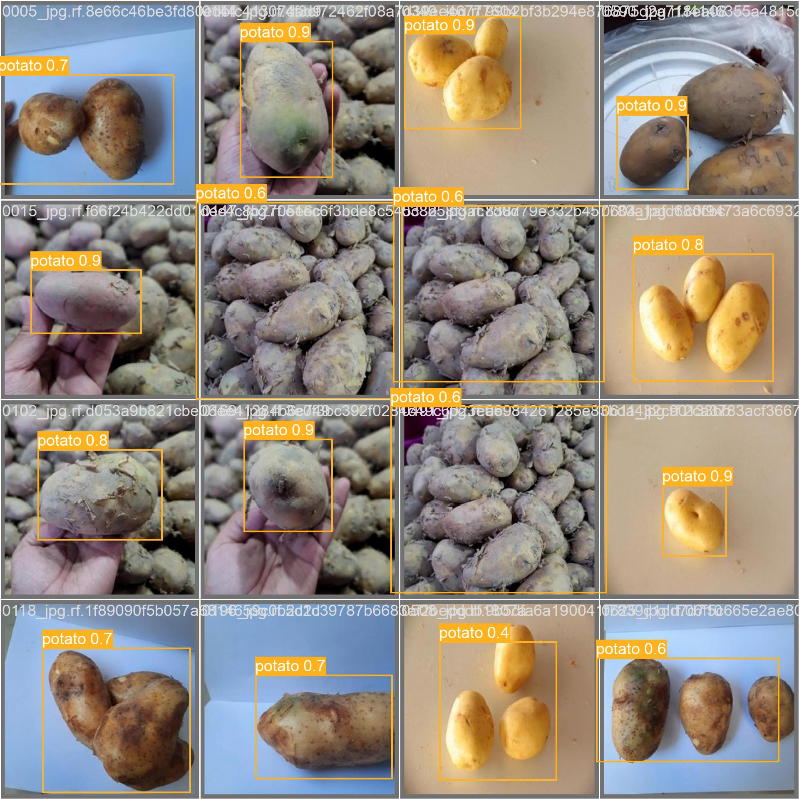

# 食材検出AIモデル (Ingredient Detector)

このプロジェクトは、YOLOv5をファインチューニングして作成した、特定の食材（じゃがいも、たまねぎ、肉、人参）を画像から検出するAIモデルです。

## 主な機能

- 画像内の食材を検出し、その名前をリストとして出力します。
- 現在検出できる食材: `potato`, `onion`, `meat`, `carrot`
- コマンドラインから簡単に実行できます。

## モデルについて

- ベースモデル: YOLOv5s
- 200エポック学習
- 検証データでの精度: mAP@0.5 ≈ 0.84、mAP@0.5:0.95 ≈ 0.69

## フォルダ構成
```
curry-ingredient-detector/
│
├── yolov5/                    # YOLOv5本体（リポジトリには含まない。下記セットアップでclone）
├── models/
│   └── best.pt                # 学習済みモデル（本リポジトリに含む）
│
├── datasets/
│   └── data.yaml               # クラス定義（データ本体はリポジトリに含まない）
├── curry/                     # (データセットのサンプル、リポジトリには含まない)
├── test_images/               # テスト用画像（リポジトリには含まない）
├── examples/                  # 実行例用のサンプル画像・検出結果画像
│
├── estimate.py                # 推定実行スクリプト
├── train.py                   # 再学習用スクリプト
├── requirements.txt           # 必要なライブラリ
└── README.md
```

## セットアップ方法

1.  **このリポジトリをクローンします:**
```bash
git clone https://github.com/KannoKens/curry-ingredient-detector.git
cd curry-ingredient-detector
```

2.  **YOLOv5公式リポジトリをクローンします:**
```bash
git clone https://github.com/ultralytics/yolov5.git
git -C yolov5 checkout 2540fd4c1c2d9186126a71b3eb681d3a0a11861e  # 動作確認済みコミット
```

3.  **仮想環境を作成し、ライブラリをインストールします:**
```bash
python -m venv venv
source venv/bin/activate  # Mac/Linux
# venv\Scripts\activate    # Windows
pip install -r requirements.txt
```

## 使い方

以下のコマンドで、画像内の食材を推定し、結果を標準出力に表示します。

```bash
python estimate.py [画像ファイルのパス]
```

実行例:
```bash
$ python estimate.py examples/sample.jpg
potato
```

検証データに対する検出例:



## モデルの再学習について

データセットを更新し、モデルを再学習させたい場合は `train.py` を使用します。
データセットのパスは `train.py` 冒頭の `DATA_YAML_PATH`（`datasets/data.yaml`）で固定しているため、その構成でデータを配置してください。

```bash
# 基本的な再学習コマンド
# 結果は yolov5/runs/train/new_ingredient_model/ に保存されます
python train.py --img-size 640 --batch-size 8 --epochs 100 --weights yolov5s.pt --name new_ingredient_model
```
